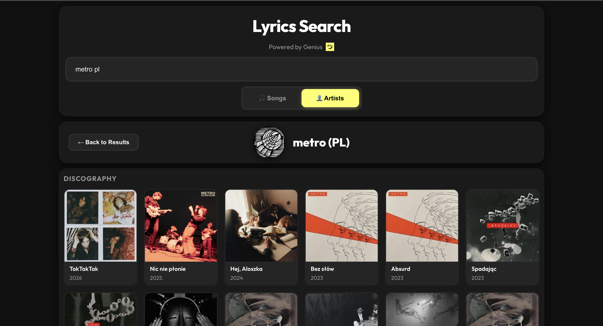

# Genius Lyrics Search

A faster, lighter Genius app — quickly find song lyrics or explore complete artist discographies with ease.

---

---

### Key Features

- 🎵 **Dual-Mode Search:** Easily toggle between searching for "Songs" or "Artists."
- 👨‍🎤 **Detailed Artist View:** View an artist's complete discography, sorted by release date.
- ⚡️ **Progressive Loading:** Artist songs load in the background so you can start browsing immediately. You can even pause and resume loading at any time.
- ⌨️ **Full Keyboard Control:** Navigate the entire app using only your keyboard.
- 🚀 **Fast & Responsive:** A speedy interface that works great on desktop, tablets, and mobile devices.
- 🏗️ **Framework-Free:** Built with modern, dependency-free vanilla JavaScript.

---

## How to Use (Controls)

The application is designed for easy use with both a mouse and keyboard.

### Global Controls (Work Anywhere)

- **Start a Search:**
  - **Mouse:** Click the search bar.
  - **Keyboard:** Just start typing.

- **Switch Search Mode:**
  - **Mouse:** Click the "Songs" or "Artists" buttons.
  - **Keyboard:** Press `Tab`.

### On the Search Results Page

- **Navigate Results:**
  - **Mouse:** Hover over any item.
  - **Keyboard:** Use `ArrowUp` and `ArrowDown`.

- **Select a Result:**
  - **Mouse:** Click an item.
  - **Keyboard:** Press `Enter` on a highlighted item.

- **Clear the Search:**
  - **Keyboard:** Press `Escape` (Esc).

### On the Artist Detail Page

- **Navigate the Song Grid:**
  - **Mouse:** Hover over a song.
  - **Keyboard:** Use `ArrowUp`, `ArrowDown`, `ArrowLeft`, and `ArrowRight`.

- **Pause/Resume Song Loading:**
  - **Mouse:** Click the spinning icon next to "Discography."
  - **Keyboard:** Press the `Spacebar`.

- **View a Song/Artist on Genius:**
  - **Mouse:** Click any song cover, or the artist's name in the header.
  - **Keyboard:** Press `Enter` on a selected song or when no song is selected to open the artist's page.

- **Go Back to Results:**
  - **Mouse:** Click the "← Back to Results" button.
  - **Keyboard:** Press `Escape` (Esc).

---

## Architecture

The application is built using a **Component-Based Architecture with a Central Controller**. This pattern creates a strong separation of concerns, making the code modular, scalable, and easier to understand. The architecture is divided into four primary layers that work together.

#### 1. The Central Controller (`app.js`)

The `MusicApp` class in `app.js` is the brain of the application, acting as the central hub that connects all other parts. Its key responsibilities are managing the application's state (like which view is active), orchestrating the UI components, and managing the overall data flow. It receives requests from the UI, fetches data via the API service, processes it, and sends it back to the appropriate component to be displayed. It also listens for global events like keyboard shortcuts that affect the entire application.

#### 2. View Components (`/components`)

Components are self-contained, reusable classes that manage a specific piece of the user interface. They are responsible for rendering HTML and handling direct user interactions within their scope, reporting those actions back to the central controller via callbacks. The main components include `SearchBar.js` for the search input, `ResultsList.js` for displaying search results, and `ArtistView.js` for the detailed artist page. To promote code reuse, `SelectableList.js` serves as a base class that provides shared keyboard and mouse navigation logic to both the results list and the artist view.

#### 3. API Service (`/services/api.js`)

This module is the application's sole connection to the external Genius API, abstracting away all the complexity of network requests. It encapsulates all API logic, including URLs, access tokens, `fetch` calls, and asynchronous `async/await` logic within a single file. By exposing a clear interface with simple functions like `searchGenius(query)`, it allows the rest of the application to request data without needing to know the implementation details of the network communication.

#### 4. Utilities (`utils.js`)

This file acts as a shared toolbox of stateless helper functions and constants that can be used anywhere in the application to prevent code duplication and keep logic clean. It includes crucial performance functions like `debounce` to limit API calls, data formatters like `extractYear`, and application-wide constants such as `SEARCH_MODES` to ensure consistency across all components.

---

## Comprehensive Application Flow

The application's flow is event-driven and follows a predictable, unidirectional pattern: an action in a **View Component** is reported to the **Central Controller**, which uses the **API Service** to fetch data, and then sends that data back to a **View Component** to update the UI.

Here are two detailed examples.

### Flow 1: Performing a Standard Search

This flow outlines the efficient, asynchronous process of a user searching for a song or artist.

1.  **User Action:** The user types a character into the search input.
2.  **View Component (`SearchBar.js`):** The component's `'input'` event listener fires. The `onSearch` callback is scheduled to run, but it is wrapped in a `debounce` function from `utils.js`. This means the callback is delayed and will only execute once the user has stopped typing for 300ms, preventing an API call on every single keystroke.
3.  **Central Controller (`app.js`):** After the debounce delay, the `handleSearch` method is finally called.
    a. **Cancellation:** It first checks if a previous search request is still in flight. If so, it calls `abort()` on a `fetchController`. This is crucial to prevent a race condition where slower, old results could arrive after and overwrite newer results.
    b. **Loading State:** It immediately tells the `ResultsList` component to render a "Searching..." message so the user gets instant feedback.
    c. **API Call:** It `await`s a call to the `searchGenius()` function from the `api.js` service, passing the query and the abort signal.
4.  **API Service (`api.js`):** The service constructs the full API URL, makes the `fetch` request, and returns a `Promise` that will resolve with the response data.
5.  **Data Processing (Controller):** Once the `Promise` resolves, execution in `handleSearch` resumes. It processes the raw API response, filtering and mapping it into a clean array of song or artist objects tailored for the UI.
6.  **UI Update (View Component):** The controller passes this clean data to the `ResultsList` component by calling its `update()` method. The `ResultsList` then clears its old content and renders the new list of results to the DOM, completing the cycle.

### Flow 2: Viewing an Artist's Discography

This more complex flow showcases parallel asynchronous operations and progressive data loading for a superior user experience.

1.  **User Action:** The user clicks on an artist in the search results list.
2.  **View Component (`ResultsList.js`):** The click handler determines the item is an artist and invokes a callback, passing the unique artist ID to the central controller.
3.  **Central Controller (`app.js`):** The controller's `showArtistDetails` method is called. It immediately switches the view to the `ArtistView` and displays a generic "Loading artist..." message.
4.  **Parallel Fetching:** To make the page load faster, the controller initiates **two asynchronous requests at the same time** without waiting for either to complete:
    - **Request 1:** A `Promise` to fetch the main artist details (`getArtistDetails`). This is high-priority data like the artist's name and image.
    - **Request 2:** A call to `fetchAllArtistSongs`, a function designed for progressive loading.
5.  **Progressive Song Loading:**
    a. The `fetchAllArtistSongs` function in `api.js` doesn't fetch all songs at once. It fetches the **first page** of songs (e.g., 50 results).
    b. As soon as that first page arrives, it calls the `onPageLoaded` callback function that was provided by the controller.
    c. The controller's `onPageLoaded` function immediately tells the `ArtistView` to render this first batch of songs.
    d. The `fetchAllArtistSongs` function continues this process in the background, fetching page 2, then page 3, and calling the callback each time a new page of songs is loaded. The user sees the song grid filling up in real-time.
6.  **Awaiting Critical Data:**
    a. While songs are loading progressively, the `showArtistDetails` method is still waiting specifically on the `Promise` from **Request 1** (`getArtistDetails`).
    b. As soon as the main artist info (name, image) arrives, the controller tells the `ArtistView` to render the page header. The user now sees the artist's identity, which feels like the page has loaded, even as the song grid continues to populate below.
7.  **Completion:** Once all song pages have been fetched, the `fetchAllArtistSongs` function finishes. The controller then tells the `ArtistView` to update its state to "complete" by changing the loading spinner to a checkmark, indicating that the entire discography has been loaded.
